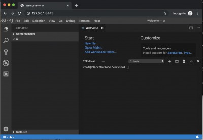
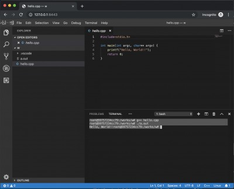

Build clang's development environment with vscode on docker by code-server


(1) run a docker image.
 
```
git clone https://github.com/kyorohiro/clang-code-server.git
cd clang-code-server
docker build -t clang_vscode .
docker run -p 8443:8443 -p 8080:8080 -it clang_vscode bash
```


(2) run vscode at code-server

```
mkdir /works/w
/works/code-server /works/w --allow-http --no-auth
```

(3) and open 'http://127.0.0.1:8443/' at your browser 




## Install Clang Plugin
https://code.visualstudio.com/docs/languages/cpp


## Build&RUN Hello World

(1) Write Code

```hello.cpp
#include<stdio.h>

int main(int argc, char** argv) {
    printf("Hello, World!!");
    return 0;
}
```

(2) Terminal -> New Terminal on VSCODE

(3) on Terminal

```
root@59757234cc79:/works/w# g++ hello.cpp
root@59757234cc79:/works/w# ./a.out 
Hello, World!!root@59757234cc79:/works/w# 
```





# PS

[a] restart a container

```
$ docker ps -a
check id and
$ docker exec -it < id > bash
```

[b] reset configure which like port and mount etc.
$ docker commit < id > clang_vscode_xxx
$ docker run -p 8443:8443 -p 8080:8080 -it clang_vscode_xxx bash

[c] mount volume
$ docker run -p 8443:8443 -p 8080:8080 -v /Users/kyorohiro/w/dart/xxx:/works/w -it clang_vscode bash


